# MeshJS Proposal Overview - Project Catalyst

List of funded proposals from MeshJS at Cardano's Project Catalyst.

# Fund 10

|Project ID|1000107|
|:-----------|:-------------|
|Name|MeshJS SDK Operations: Supporting Open-Source Library Development, Developer Resources & Builder Community|
|Link|[Open full project](https://projectcatalyst.io/funds/10/f10-osde-open-source-dev-ecosystem/meshjs-sdk-operations-supporting-open-source-library-development-developer-resources-and-builder-community)|
|Milestones|[Milestones](https://milestones.projectcatalyst.io/projects/1000107)|
|Funding Category|F10: OSDE: Open Source Dev Ecosystem|
|Proposal Budget|ADA 169,413|
|Status|In Progress|
|Milestones completed|5/5|
|Finished|September, 2024|

# Fund 11

|Project ID|1100271|
|:-----------|:-------------|
|Name|Sustain & Maintain MeshJS|
|Link|[Open full project](https://projectcatalyst.io/funds/11/cardano-open-developers/sustain-and-maintain-meshjs)|
|Milestones|[Milestones](https://milestones.projectcatalyst.io/projects/1100271)|
|Funding Category|F11: Cardano Open: Developers|
|Proposal Budget|ADA 150,000|
|Status|Completed|
|Milestones completed|5/5|
|Finished|September 15, 2024|

# Fund 12

|Project ID|1200148|
|:-----------|:-------------|
|Name|Mesh Software as a Service|
|Link|[Open full project](https://projectcatalyst.io/funds/12/f12-cardano-use-cases-concept/mesh-software-as-a-service)|
|Milestones|[Milestones](https://milestones.projectcatalyst.io/projects/1200148)|
|Funding Category|F12: Cardano Use Cases: Concept|
|Proposal Budget|ADA 100,000|
|Status|In Progress|
|Milestones completed|2/5|

|Project ID|1200220|
|:-----------|:-------------|
|Name|Sustain and Maintain Mesh SDK|
|Link|[Open full project](https://projectcatalyst.io/funds/12/f12-cardano-open-developers/sustain-and-maintain-mesh-sdk)|
|Milestones|[Milestones](https://milestones.projectcatalyst.io/projects/1200220)|
|Funding Category|F12: Cardano Open: Developers|
|Proposal Budget|ADA 200,000|
|Status|Completed|
|Milestones completed|5/5|

|Project ID|1200147|
|:-----------|:-------------|
|Name|Mesh New Features to Improve Developer experience and Cardano Adoption|
|Link|[Open full project](https://projectcatalyst.io/funds/12/f12-cardano-open-developers/mesh-new-features-to-improve-developer-experience-and-cardano-adoption)|
|Milestones|[Milestones](https://milestones.projectcatalyst.io/projects/1200147)|
|Funding Category|F12: Cardano Open: Developers|
|Proposal Budget|ADA 200,000|
|Status|In Progress|
|Milestones completed|4/5|

# Fund 13

|Project ID|1300036|
|:-----------|:-------------|
|Name|Cardano Builder Fest Asia by Mesh, Socious, SIDAN, Vietnam Cardano|
|Link|[Open full project](https://projectcatalyst.io/funds/10/f13-cardano-open-ecosystem/cardano-builder-fest-asia-by-mesh-socious-sidan-vietnam-cardano)|
|Milestones|[Milestones](https://milestones.projectcatalyst.io/projects/1300036)|
|Funding Category|F13: Cardano Open: Ecosystem|
|Proposal Budget|ADA 99,016|
|Status|In Progress|
|Milestones completed|2/4|

|Project ID|1300134|
|:-----------|:-------------|
|Name|Mesh: Cquisitor - Transaction Investigation Tool|
|Link|[Open full project](https://projectcatalyst.io/funds/10/f13-cardano-open-developers/mesh-cquisitor-transaction-investigation-tool)|
|Milestones|[Milestones](https://milestones.projectcatalyst.io/projects/1300134)|
|Funding Category|F13: Cardano Open: Developers|
|Proposal Budget|ADA 200,000|
|Status|In Progress|
|Milestones completed|0/5|

|Project ID|1300135|
|:-----------|:-------------|
|Name|Mesh: Hydra Tools for administrating & interacting with Hydra Heads|
|Link|[Open full project](https://projectcatalyst.io/funds/10/f13-cardano-open-developers/mesh-hydra-tools-for-administrating-and-interacting-with-hydra-heads)|
|Milestones|[Milestones](https://milestones.projectcatalyst.io/projects/1300135)|
|Funding Category|F13: Cardano Open: Developers|
|Proposal Budget|ADA 200,000|
|Status|In Progress|
|Milestones completed|2/5|

|Project ID|1300050|
|:-----------|:-------------|
|Name|Cardano Multisig Platform by Mesh, Clarity DAO & Fluid Tokens|
|Link|[Open full project](https://projectcatalyst.io/funds/10/f13-cardano-use-cases-product/cardano-multisig-platform-by-mesh-clarity-dao-and-fluid-tokens)|
|Milestones|[Milestones](https://milestones.projectcatalyst.io/projects/1300050)|
|Funding Category|F13: Cardano Use Cases: Product|
|Proposal Budget|ADA 500,000|
|Status|In Progress|
|Milestones completed|1/5|

|Project ID|1300130|
|:-----------|:-------------|
|Name|Maintain Mesh and Build Developer Community|
|Link|[Open full project](https://projectcatalyst.io/funds/10/f13-cardano-open-developers/maintain-mesh-and-build-developer-community)|
|Milestones|[Milestones](https://milestones.projectcatalyst.io/projects/1300130)|
|Funding Category|F13: Cardano Open: Developers|
|Proposal Budget|ADA 200,000|
|Status|In Progress|
|Milestones completed|1/5|

# Milestone Progress Visualizations

## Pie Charts

```mermaid
%%{init: {'theme':'forest'}}%%
pie
    title 🏆 MeshJS SDK Operations: Supporting Ope... - Complete!
    "Completed 5/5" : 5
    "Remaining" : 0
```

**[Project ID: 1000107](https://milestones.projectcatalyst.io/projects/1000107)**

```mermaid
%%{init: {'theme':'forest'}}%%
pie
    title 🏆 Sustain & Maintain MeshJS - Complete!
    "Completed 5/5" : 5
    "Remaining" : 0
```

**[Project ID: 1100271](https://milestones.projectcatalyst.io/projects/1100271)**

```mermaid
%%{init: {'theme':'neutral'}}%%
pie
    title 🔄 Mesh Software as a Service - In Progress
    "Completed 2/5" : 2
    "Remaining" : 3
```

**[Project ID: 1200148](https://milestones.projectcatalyst.io/projects/1200148)**

```mermaid
%%{init: {'theme':'forest'}}%%
pie
    title 🏆 Sustain and Maintain Mesh SDK - Complete!
    "Completed 5/5" : 5
    "Remaining" : 0
```

**[Project ID: 1200220](https://milestones.projectcatalyst.io/projects/1200220)**

```mermaid
%%{init: {'theme':'default'}}%%
pie
    title 🔜 Mesh New Features to Improve Develope... - Nearly Complete
    "Completed 4/5" : 4
    "Remaining" : 1
```

**[Project ID: 1200147](https://milestones.projectcatalyst.io/projects/1200147)**

```mermaid
%%{init: {'theme':'neutral'}}%%
pie
    title 🔄 Cardano Builder Fest Asia by Mesh, So... - In Progress
    "Completed 2/4" : 2
    "Remaining" : 2
```

**[Project ID: 1300036](https://milestones.projectcatalyst.io/projects/1300036)**

```mermaid
%%{init: {'theme':'dark'}}%%
pie
    title 📋 Mesh: Cquisitor - Transaction Investi... - Not Started
    "Completed 0/5" : 0
    "Remaining" : 5
```

**[Project ID: 1300134](https://milestones.projectcatalyst.io/projects/1300134)**

```mermaid
%%{init: {'theme':'neutral'}}%%
pie
    title 🔄 Mesh: Hydra Tools for administrating ... - In Progress
    "Completed 2/5" : 2
    "Remaining" : 3
```

**[Project ID: 1300135](https://milestones.projectcatalyst.io/projects/1300135)**

**[Project ID: 1300050](https://milestones.projectcatalyst.io/projects/1300050)**

```mermaid
%%{init: {'theme':'dark'}}%%
pie
    title 🚀 Maintain Mesh and Build Developer Com... - Getting Started
    "Completed 1/5" : 1
    "Remaining" : 4
```

**[Project ID: 1300130](https://milestones.projectcatalyst.io/projects/1300130)**

## Progress Cards

## ✅ MeshJS SDK Operations: Supporting Open-Source L...

**Project ID: [1000107](https://milestones.projectcatalyst.io/projects/1000107)** | **Status: Completed**

<table>
  <tr>
    <td>
      <strong>Milestones Complete:</strong> 5/5 (100%)
    </td>
  </tr>
  <tr>
    <td>
      <code>████████████████████</code>
    </td>
  </tr>
</table>

## ✅ Sustain & Maintain MeshJS

**Project ID: [1100271](https://milestones.projectcatalyst.io/projects/1100271)** | **Status: Completed**

<table>
  <tr>
    <td>
      <strong>Milestones Complete:</strong> 5/5 (100%)
    </td>
  </tr>
  <tr>
    <td>
      <code>████████████████████</code>
    </td>
  </tr>
</table>

## 🚀 Mesh Software as a Service

**Project ID: [1200148](https://milestones.projectcatalyst.io/projects/1200148)** | **Status: Started**

<table>
  <tr>
    <td>
      <strong>Milestones Complete:</strong> 2/5 (40%)
    </td>
  </tr>
  <tr>
    <td>
      <code>████████░░░░░░░░░░░░</code>
    </td>
  </tr>
</table>

## ✅ Sustain and Maintain Mesh SDK

**Project ID: [1200220](https://milestones.projectcatalyst.io/projects/1200220)** | **Status: Completed**

<table>
  <tr>
    <td>
      <strong>Milestones Complete:</strong> 5/5 (100%)
    </td>
  </tr>
  <tr>
    <td>
      <code>████████████████████</code>
    </td>
  </tr>
</table>

## 🔆 Mesh New Features to Improve Developer experien...

**Project ID: [1200147](https://milestones.projectcatalyst.io/projects/1200147)** | **Status: Almost Complete**

<table>
  <tr>
    <td>
      <strong>Milestones Complete:</strong> 4/5 (80%)
    </td>
  </tr>
  <tr>
    <td>
      <code>████████████████░░░░</code>
    </td>
  </tr>
</table>

## 🔄 Cardano Builder Fest Asia by Mesh, Socious, SID...

**Project ID: [1300036](https://milestones.projectcatalyst.io/projects/1300036)** | **Status: In Progress**

<table>
  <tr>
    <td>
      <strong>Milestones Complete:</strong> 2/4 (50%)
    </td>
  </tr>
  <tr>
    <td>
      <code>██████████░░░░░░░░░░</code>
    </td>
  </tr>
</table>

## 📋 Mesh: Cquisitor - Transaction Investigation Tool

**Project ID: [1300134](https://milestones.projectcatalyst.io/projects/1300134)** | **Status: Not Started**

<table>
  <tr>
    <td>
      <strong>Milestones Complete:</strong> 0/5 (0%)
    </td>
  </tr>
  <tr>
    <td>
      <code>░░░░░░░░░░░░░░░░░░░░</code>
    </td>
  </tr>
</table>

## 🚀 Mesh: Hydra Tools for administrating & interact...

**Project ID: [1300135](https://milestones.projectcatalyst.io/projects/1300135)** | **Status: Started**

<table>
  <tr>
    <td>
      <strong>Milestones Complete:</strong> 2/5 (40%)
    </td>
  </tr>
  <tr>
    <td>
      <code>████████░░░░░░░░░░░░</code>
    </td>
  </tr>
</table>

## 🚀 Cardano Multisig Platform by Mesh, Clarity DAO ...

**Project ID: [1300050](https://milestones.projectcatalyst.io/projects/1300050)** | **Status: Started**

<table>
  <tr>
    <td>
      <strong>Milestones Complete:</strong> 1/5 (20%)
    </td>
  </tr>
  <tr>
    <td>
      <code>████░░░░░░░░░░░░░░░░</code>
    </td>
  </tr>
</table>

## 🚀 Maintain Mesh and Build Developer Community

**Project ID: [1300130](https://milestones.projectcatalyst.io/projects/1300130)** | **Status: Started**

<table>
  <tr>
    <td>
      <strong>Milestones Complete:</strong> 1/5 (20%)
    </td>
  </tr>
  <tr>
    <td>
      <code>████░░░░░░░░░░░░░░░░</code>
    </td>
  </tr>
</table>

